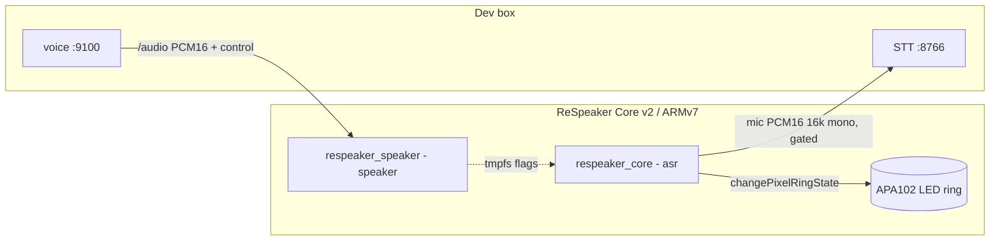

# CLAUDE.md

This file provides guidance to Claude Code (claude.ai/code) when working with code in this repository.

## Overview

C++ firmware for a **ReSpeaker Core v2** board — the kid-facing edge of a Ukrainian
voice-chat system. The board knows nothing about Claude: it ships microphone audio to
a dev box over WebSockets and plays answer audio back, gated so mic and speaker never
fight. The "brain" (Claude SDK + STT + TTS) lives in a separate repo on the dev box
(`styletts2-ukrainian/`, a.k.a. `ai-audio-role-player`).

Two binaries, both under **pm2**:

| Binary | pm2 name | Job |
|---|---|---|
| `respeaker_core` | `asr` | librespeaker mic chain (Alango VEP+AEC+beamforming + Snowboy `alexa.umdl` wake word); streams mic PCM16 to dev-box STT WS while the activation window is open; drives the LED ring. |
| `respeaker_speaker` | `speaker` | subscribes to dev-box voice `/audio` WS; plays PCM16 to ALSA; writes tmpfs flags telling `respeaker_core` to stop listening while audio plays. |

`README.md` is the detailed reference (wake window, half-duplex, LED, wire protocol,
troubleshooting). The cross-repo design doc is `styletts2-ukrainian/docs/ARCHITECTURE.md`.

## Build / deploy

Driven by `Makefile`. Run on the board, or from the dev box via
`ssh respeaker make -C ~/projects/respeaker-websockets <target>`:

```sh
make help          # list targets
make build         # single-job compile (+ syncs config.json into build/)
make deploy        # stop services → build → restart   (THE safe path on this box)
make restart       # pm2 restart asr + speaker (no rebuild)
make logs          # pm2 logs (both procs)
make status        # pm2 list + tmpfs flag files
make tmpfs-reset   # clear /tmp/respeaker_*_ms flags (debug)
make clean         # wipe build/ + reconfigure cmake
```

## Hard constraints (violating these breaks the box)

- **~984 MB RAM, NO swap.** Compiling is memory-tight (json.hpp, ixwebsocket). Always
  **stop pm2 services first** and build **single-job** (plain `make`, never `-j`) — a
  `cc1plus` spike with services live = OOM-kill. `make deploy` does this ordering for you.
- **ARMv7l: 64-bit writes are NOT atomic.** Any cross-thread 64-bit field must be
  `std::atomic<long long>` or you get torn reads (`include/ws_transport.hpp::_thinkingSetMs`).
- **`config.json` is gitignored** (holds the dev-box LAN address). CMake copies it into
  `build/` only at *configure* time — a plain `make` does NOT refresh it, so when you
  change root `config.json` you must also edit `build/config.json` (or re-run cmake).
- **Never write pixels from the main loop.** The LED ring is animated in its own pthread
  (`src/state_handler.c`); the main loop only flips state via `changePixelRingState()`.
  Direct pixel writes race the animation thread.

## Architecture



**Mic is off by default.** Saying **"Alexa"** opens a 1-min activation window; while open,
no wake word is needed. Each accepted dialog turn slides the window forward — the voice
server pushes a fresh deadline via an `/audio` `activation` frame
(`/tmp/respeaker_active_until_ms`). After 1 min of silence the mic goes off again. The
board self-bootstraps the window locally on wake and composes with the server deadline via
`max()`. Tunables: `ACTIVE_WINDOW_MS`, `WAKE_LED_HOLD_MS` in `src/main.cpp`.

**Half-duplex** (kills acoustic self-feedback by construction; no barge-in by design): mic
streams only when **window open AND not speakerActive AND not thinking AND WS connected**.
Three signals, two of them tmpfs files written by `respeaker_speaker` and read by
`respeaker_core` (write-temp + `rename(2)` so no torn reads):

| Signal | Set by | Cleared by |
|---|---|---|
| `_thinkingSetMs` (`atomic<long long>`) | `SttFinal` in `ws_transport.cpp` | `speakerActive` rising edge / clear-file > set / 30 s cap |
| `/tmp/respeaker_speaking_until_ms` | `respeaker_speaker` per PCM frame: `max(prev,now)+chunk_ms+500ms` | `interrupted` frame or `/audio` close (writes 0) |
| `/tmp/respeaker_thinking_clear_ms` | `respeaker_speaker` on `interrupted`/`/audio` close | reader compares to `_thinkingSetMs` |

**LED states** (`src/animation.c`), steady selection each ~10 ms:
`speakerActive ? ON_SPEAK : (thinking ? ON_LISTEN : ON_IDLE)`, overridden by `ON_WAKE`
during the post-wake hold window.

| State | Trigger | Animation |
|---|---|---|
| `ON_IDLE` | nothing | single LED breathing, teal |
| `ON_WAKE` | "Alexa" | one slow dim cyan breath (kid-safe, no strobe), held `WAKE_LED_HOLD_MS` |
| `ON_LISTEN` | Claude thinking (`SttFinal`) | 4-LED blue comet |
| `ON_SPEAK` | answer audio playing | 12-LED rainbow chase |

## Key files

| Concern | File |
|---|---|
| mic chain + wake gate + LED main loop | `src/main.cpp` |
| `/audio` subscriber + ALSA + tmpfs writes | `src/speaker_main.cpp` |
| STT WS client + half-duplex/activation signals | `src/ws_transport.cpp` / `include/ws_transport.hpp` |
| LED animations | `src/animation.c` |
| animation-thread state machine | `src/state_handler.c` |
| STATE enum + config keys | `include/common.h` |
| build targets (two binaries) | `CMakeLists.txt` |

## Wire protocol (summary)

- **Board → dev box:** mic PCM16 LE @ 16 kHz mono to STT `/stt/stream` (only while gated
  open). STT POSTs the transcript to voice `/prompt` — the board never relays text.
- **Dev box → board:** voice `/audio` sends `AudioStart{sample_rate,channels,format}` then
  binary PCM16; control text frames `interrupted` (flush ALSA), `hold{until_ms}` (mute mic
  for a tool window), `activation{until_ms}` (slide the window). STT `/stt/stream` `SttFinal`
  → `respeaker_core` flips LED to `ON_LISTEN`.
